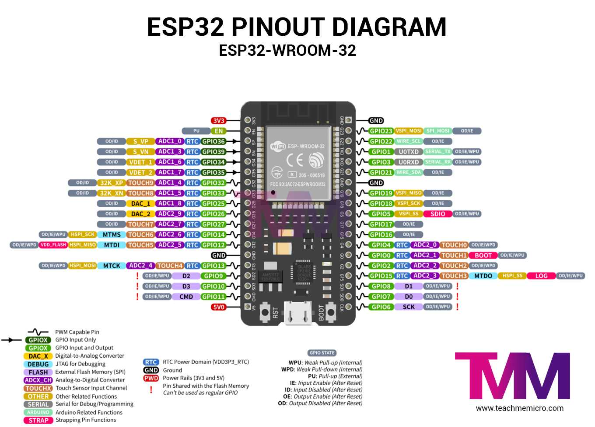
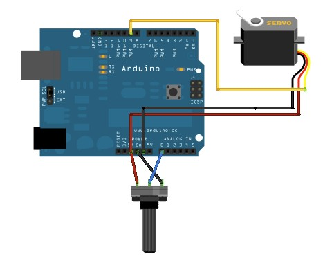
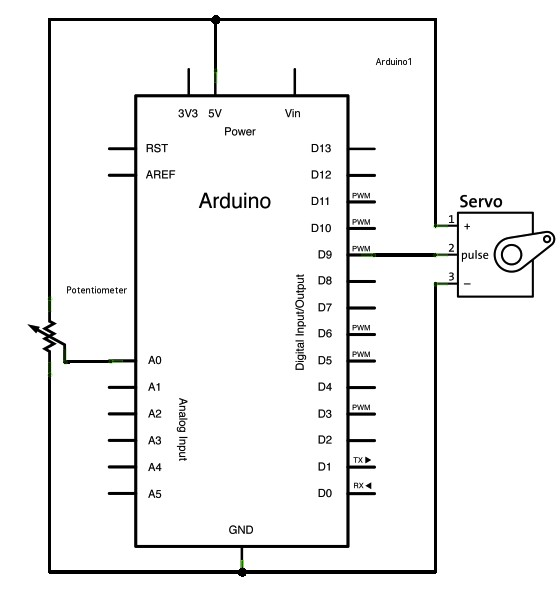

# Balancierroboter

Dieses Projekt ist der Quellcode für einen Balancierroboter mit einem Ball auf einer Kippplatte.

### Verwendete Hardware

* ESP32-WROOM-32A
* 2x Servomotor
* 2x 10k Ohm Potentiometer
* hook-up wires

## Servobeschaltung

### Knopf

Steuere die Position eines [Hobby Servo's](http://en.wikipedia.org/wiki/Servo_motor#RC_servos) mit deinem Arduino und einem Potentiometer.

Dieses Beispiel verwendet die arduino "Servo"-Bibliothek.

### Zusammenschaltung

Servo motors have three wires: power, ground, and signal. The power wire is typically red, and should be connected to the 5V pin on the Arduino board. The ground wire is typically black or brown and should be connected to a ground pin on the board. The signal pin is typically yellow or orange and should be connected to pin 9 on the board.

The potentiometer should be wired so that its two outer pins are connected to power (+5V) and ground, and its middle pin is connected to analog input 0 on the board.

(Die Schaltbilder wurden mit Fritzing erstellt. [Fritzing.org](http://fritzing.org/))

### Schaltplan

