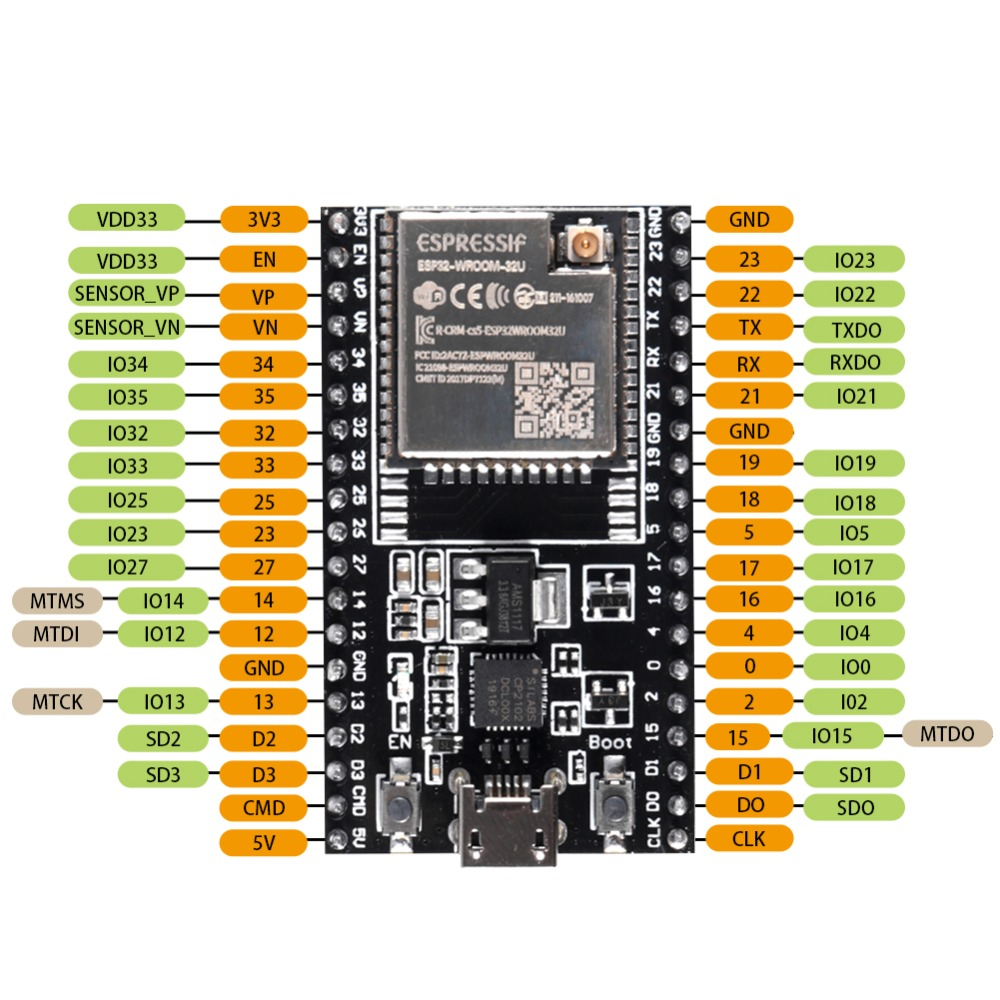
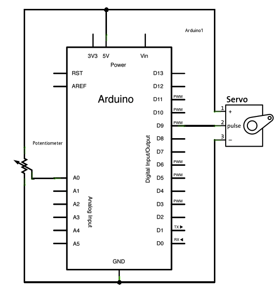

# Balancierroboter

Dieses Projekt ist der Quellcode für einen Balancierroboter mit einem Ball auf einer Kippplatte.

## Knopf

Control the position of a RC (hobby) [servo motor](http://en.wikipedia.org/wiki/Servo_motor#RC_servos) with your Arduino and a potentiometer.

This example makes use of the Arduino `Servo` library.

### Verwendete Hardware

* ESP32-WROOM-32A
* 2x Servomotor
* 2x 10k Ohm Potentiometer
* hook-up wires

### ESP32-WROOM-32U Pin-Belegung

### Zusammenschaltung

Servo motors have three wires: power, ground, and signal. The power wire is typically red, and should be connected to the 5V pin on the Arduino board. The ground wire is typically black or brown and should be connected to a ground pin on the board. The signal pin is typically yellow or orange and should be connected to pin 9 on the board.

The potentiometer should be wired so that its two outer pins are connected to power (+5V) and ground, and its middle pin is connected to analog input 0 on the board.

(Images developed using Fritzing. For more circuit examples, see the [Fritzing project page](http://fritzing.org/projects/))

### Schaltkreis

